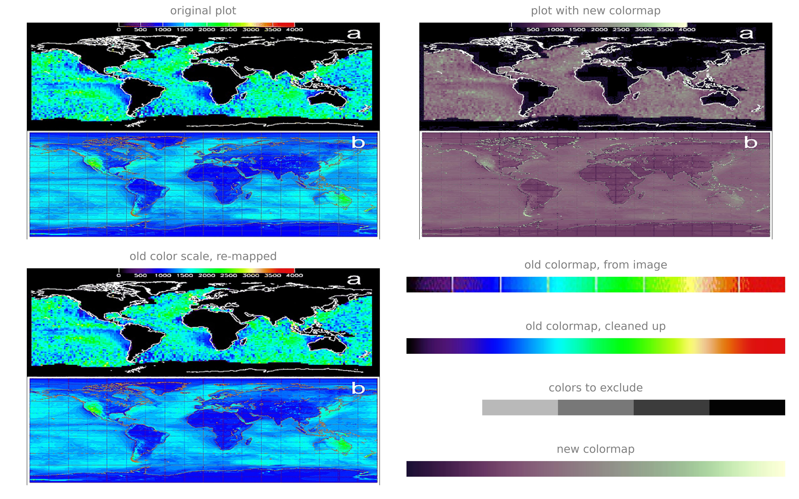

# colormap-changer

**Change the colormap of an old plot that you don't have the data for anymore.**

Here's an example. Clearly not perfect, but not too terrible either. In this case the graticule on the lower subplot kind of messes things up. Should work better on higher-resolution images.

